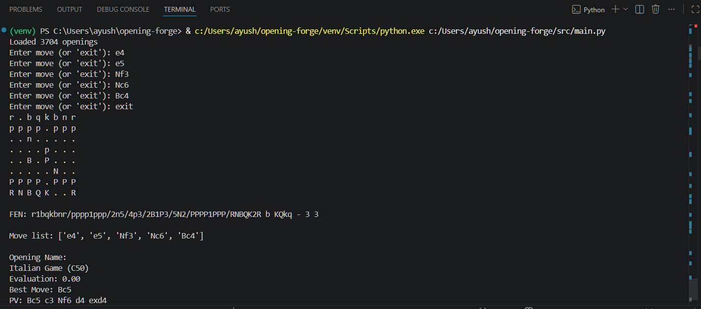
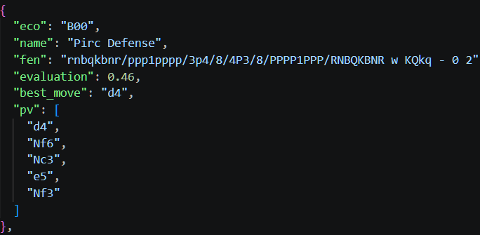
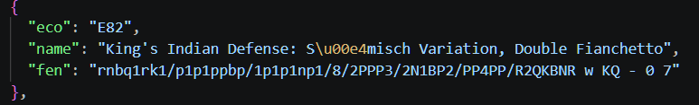
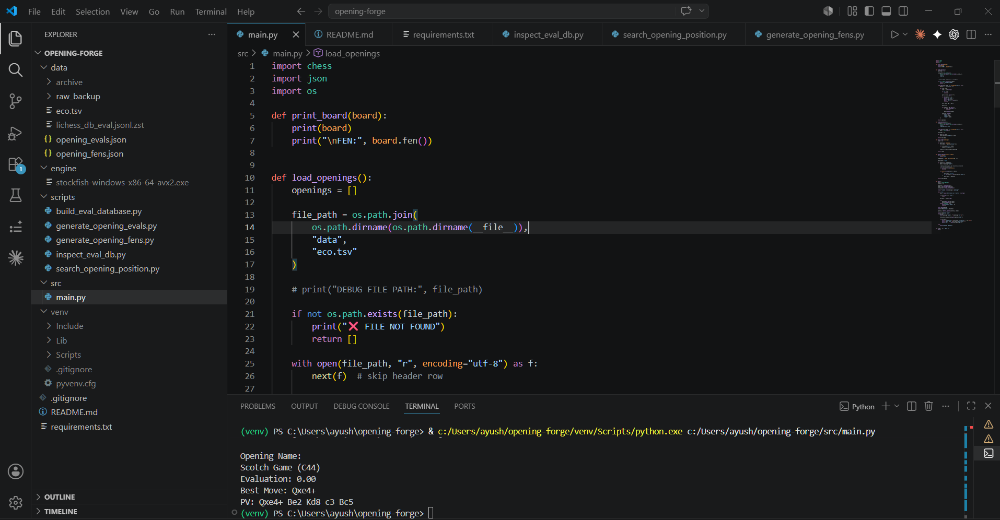
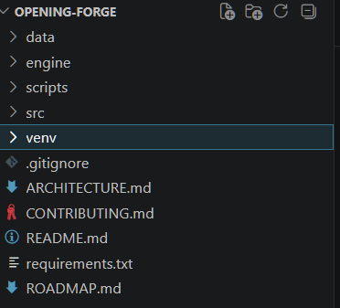

# ♟️ Opening Forge

### Open-Source Chess Opening Intelligence Platform

Most chess opening tools answer:

> **"What opening is this?"**

Opening Forge aims to answer:

> **Why do I play this opening?**  
> **Which openings fit my style?**  
> **How has my repertoire evolved?**  
> **Which grandmasters think like me?**  
> **What should I learn next?**

Opening Forge is an open-source platform for analyzing, understanding, and discovering chess openings.

Built on top of the complete Lichess ECO database, the project combines opening theory, engine analysis, player profiling, and chess analytics into a single platform for chess players.

---

## 📸 Opening Recognition + Engine Analysis



Recognize openings from user-entered moves and retrieve engine evaluations, best moves, and principal variations from a database of 3700+ openings.

---

## 🚧 Current Status

### Implemented

- Recognition of 3700+ openings and variations
- Complete Lichess ECO database integration
- SAN move validation using `python-chess`
- Deepest opening detection
- Fast indexed opening lookup
- Engine evaluation database generation
- Principal variation extraction
- Best move recommendations
- Position database generation
- FEN indexing framework
- Command-line opening explorer

### Currently Working On

- Position intelligence system
- Position-to-opening recognition
- Transposition detection
- Opening analytics
- Interactive platform development

---

## ✨ Features

### Current Features

- Opening recognition from move sequences
- ECO classification
- Deep opening matching
- SAN move validation
- Engine evaluations
- Best move recommendations
- Principal variation analysis
- Position database generation
- FEN indexing
- Fast indexed search

### Planned Features

- Position explorer
- Opening analytics
- Player DNA system
- Personalized opening recommendations
- Automated repertoire generation
- Opening cards
- Chess personality profiles
- Interactive dashboard
- Opening Wrapped reports

For the complete roadmap, see **ROADMAP.md**.

---

## 🛠 Technical Screenshots

### Engine Evaluation Database



Engine-generated evaluation dataset containing evaluations, best moves, and principal variations for thousands of opening positions.

---

### Position Intelligence Dataset



FEN-indexed opening position database that enables future position recognition and transposition detection.

---

### Codebase Overview



Opening Forge workspace showing project organization, datasets, engine integration, scripts, and supporting documentation.

---

### Repository Structure



Project organization showing data pipelines, engine integration, scripts, source code, and documentation.

---

## 🚀 Example

### Input

```text
e4
e5
Nf3
Nc6
Bc4
```

### Output

```text
Opening Name:
Italian Game (C50)

Evaluation:
0.00

Best Move:
Bc5

Principal Variation:
Bc5 c3 Nf6 d4 exd4
```

---

## 📚 Documentation

- 📍 **ROADMAP.md** — Project vision and development roadmap
- 🏗️ **ARCHITECTURE.md** — System design and technical architecture
- 🤝 **CONTRIBUTING.md** — Contributor guide and development workflow

---

## 🎯 Why Opening Forge?

Most opening tools focus on identification.

Most training tools focus on memorization.

Opening Forge focuses on understanding.

The goal is to help players answer questions such as:

- Which openings fit my natural style?
- Which positions am I most comfortable playing?
- How has my repertoire changed over time?
- Which players have similar opening preferences?
- What should I learn next?
- Which openings should I add to my repertoire?
- Which positions consistently give me trouble?

Rather than being another opening encyclopedia, Opening Forge aims to become a platform for discovering the relationships between openings, positions, engine evaluations, and player behavior.

---

## 🤝 Contributing

Opening Forge welcomes contributions of all sizes.

Contributions are especially welcome in:

- Python development
- Chess analytics
- Data engineering
- Machine learning
- Frontend development
- UI/UX design
- Documentation

If you're interested in chess, analytics, or open-source development, check **CONTRIBUTING.md** to get started.

You can also look for issues labeled:

- `good first issue`
- `help wanted`

---

## 🏗️ Long-Term Vision

Opening Forge is not intended to be another opening explorer.

The long-term goal is to build a complete Chess Opening Intelligence Platform that connects:

- Openings
- Positions
- Engine evaluations
- Player styles
- Repertoires
- Historical trends
- Recommendation systems

into a single interconnected system.

Ultimately, Opening Forge aims to help players understand not only **what they play**, but **why they play it**.

---

## 📄 License

An open-source license will be added before the first major release.

---

## ⭐ Support

If you find Opening Forge interesting, consider starring the repository.

Feature ideas, bug reports, discussions, and pull requests are always appreciated.

---

> **Transforming chess openings from a collection of moves into a system of insights, relationships, and player understanding.**
